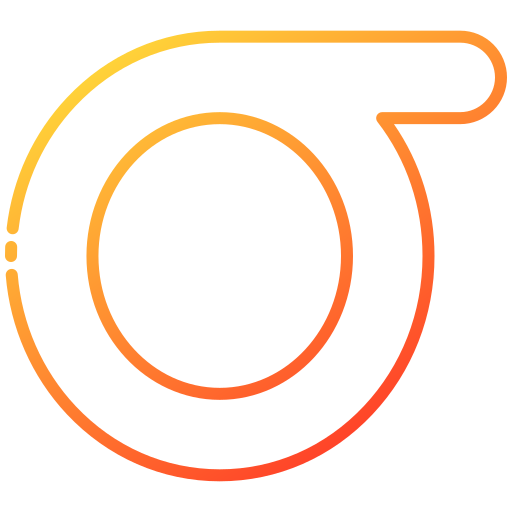

  

<h1 align="center">Hey 👋 What's up?!</h1>

  

Welcome to my GitHub profile! I'm **Ragib**, a passionate software engineer with a keen interest in web programming, cybersecurity, and systems programming. Below you'll find more about me, my projects, and how to get in touch.

## 🚀 About Me

💻 I am a **Computer Scientist and Mathematician** with experience in various programming languages and frameworks.

- 🎓 Pursuing a BA in Computer Science with a minor in Mathematics from CUNY Hunter College.
- 🌱 Currently learning computer security and systems programming.
- 🛠️ I love building real world applications and exploring new technologies.
- 👯 I'm open to collaborating on interesting projects and contributing to open-source communities.

### 🌟 Fun Facts

- 🚴 I enjoy hiking and outdoor adventures.
- 📚 I enjoy reading classic literature.
- 🎲 I'm always up for a good book recommendation!

### 🎯 Goals

- 🌞 Obtain a PhD.
- ✨ Build a successful startup.

## 📚 Projects

Here are some of my notable projects:

- **Music Visualizer**
  - [Demo](https://ragibasif.github.io/music-visualizer/)
  - [Code](https://github.com/ragibasif/music-visualizer)
- **NYC Vehicle Crash Analysis**
  - [Demo](https://ragibasif.github.io/NYC-mvc-crashes/)
  - [Code](https://github.com/ragibasif/NYC-mvc-crashes)
- **Portfolio Website**
  - [Demo](https://ragibasif.github.io)
  - [Code](https://github.com/ragibasif/ragibasif.github.io)

## 🛠️ Technologies & Tools

  
  
  
  
  
  
  
  
  
  
  
  
  

###

- **Languages:** Python, JavaScript, HTML, CSS, C, C++
- **Frameworks/Libraries:** React, Node.js
- **Databases:** MongoDB
- **Tools:** Git

## 📈 GitHub Statistics

  
  
  
  
  
  

## 📫 Get in Touch

  
  

- **Email:** [ragib.asif30@myhunter.cuny.edu](mailto:ragib.asif30@myhunter.cuny.edu)
- **LinkedIn:** [@ragibasif](https://www.linkedin.com/in/ragibasif)

## 💬 Let's Connect

Feel free to reach out if you want to discuss technology, collaboration, or just say hi. I'm always open to making new connections and learning from others.

Thanks for visiting my profile! Have a great day! 😊

